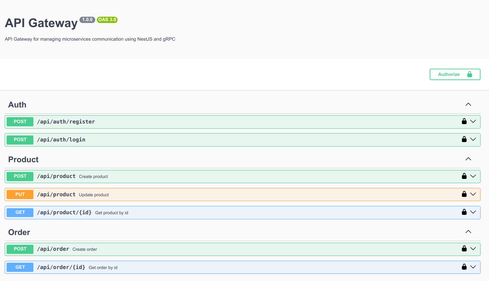

# NestJS Microservice gRPC

# Introduction
This project uses NestJS microservices with gRPC for inter-service communication. It follows a monorepo structure and applies CQRS for clear separation of command and query operations. The system leverages Event Sourcing with Event Store and integrates Kafka for asynchronous messaging and scalability.

# Technologies Used
+ NestJS: A backend framework for Node.js with TypeScript, enabling scalable and maintainable applications.

+ Monorepo: All projects are stored in a single repository for easier management and integration.

+ gRPC: A high-performance RPC framework for efficient microservice communication.

+ CQRS: Separates command (write) and query (read) operations for better performance and scalability.

+ Kafka: A distributed stream processing platform that allows real-time data transmission and processing in microservices systems.

+ Event Sourcing: Stores events instead of system state, allowing the recreation of the state from the stored events.

+ Event Store: A system for storing events in Event Sourcing, enabling state recovery.

+ MySQL: A relational database used to store and manage the application's core data.

+ MongoDB: A NoSQL database used for storing event stores, suitable for systems that require event-driven architecture and flexible scalability.

# Installation Guide

## Step 1: Clone the Project
Clone the project to your local machine:

``` bash
git clone https://github.com/maivankien/nestjs-microservice-grpc.git
cd nestjs-microservice-grpc
```

## Step 2: Config environment
Configure .env file based on .env.example file

## Step 3: Run Docker Compose
Start the services using Docker Compose:

```bash
docker-compose up -d
```

## Step 4: Create table
Create sql tables

### Visit: http://localhost:3000/api-gateway

